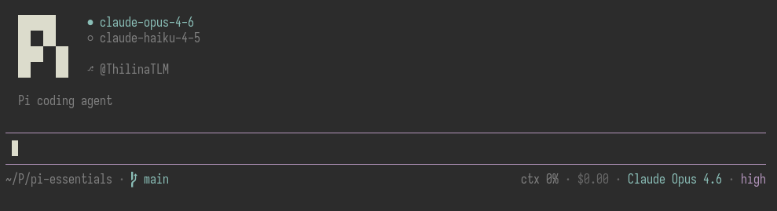

# pi-essentials

My personal set of essential tools and UI tweaks for [pi coding agent](https://github.com/badlogic/pi-mono).



This is primarily built for my own workflow. You're welcome to use it too, but I may make breaking changes at any time without notice.

## Included

- ask user prompt (`ask_user`)
- todos (`todos_set`, `todos_get`)
- web search via Tavily (`web_search`)
- web fetch (`web_fetch`)
- plan mode tools and commands
- a custom footer

## Install

Install it with pi from git:

```bash
pi install git:git@github.com:ThilinaTLM/pi-essentials.git
```

For package/extension loading details, see the pi coding agent docs for packages and extensions.

## Config

`web_search` requires:

```bash
export TAVILY_API_KEY=your_key_here
```

## Note

This repo is meant to keep pi stocked with the tools and customizations I consider essential — not to provide a stable public API or compatibility guarantees.
